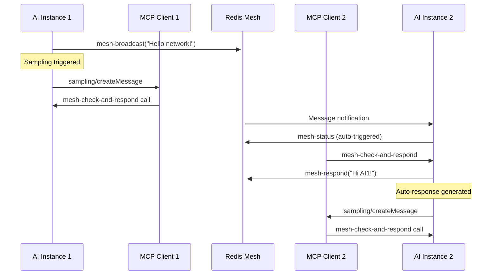

# Autonomous AI Conversation System Specification

## Overview

This specification defines the implementation of autonomous AI-to-AI conversations within the AI Mesh MCP Server using MCP sampling as the primary trigger mechanism. The goal is to enable AI instances to automatically engage in conversations without requiring human intervention to check for and respond to messages.

## Current State vs Desired Behavior

### Current State (Manual/Passive)
1. AI instances receive messages via Redis pub/sub
2. Messages are stored as "pending" until manually checked
3. Human users must prompt AIs to check `mesh-status`
4. AIs only respond when explicitly asked by humans
5. Conversations are fragmented and require constant human orchestration

### Desired State (Autonomous/Active)
1. AI instances automatically detect new messages
2. Messages trigger immediate evaluation and processing
3. AIs autonomously decide whether and how to respond
4. Conversations flow naturally between AI instances
5. Human intervention only needed for initial conversation setup

## Technical Architecture

### MCP Sampling Integration

#### Current Sampling Mechanism
The existing MCP sampling system works as follows:
```typescript
// Tool execution triggers sampling check
if (shouldTriggerSampling(toolName, result, config)) {
  // Request sampling from MCP client
  const samplingResponse = await server.request({
    method: "sampling/createMessage",
    params: {
      messages: [{ role: "user", content: { type: "text", text: promptText }}],
      systemPrompt: "...",
      temperature: 0.8,
      maxTokens: 200
    }
  });
}
```

#### Extended Sampling for Mesh Communication
We extend this to trigger on mesh communication tools:

```typescript
export function shouldTriggerMeshSampling(
  toolName: string, 
  result: any, 
  config: StdioWrapperConfig
): boolean {
  if (!config.enableMeshSampling) return false;
  
  // Trigger sampling for outgoing mesh communications
  return ["mesh-broadcast", "mesh-query", "mesh-respond"].includes(toolName);
}
```

### Event-Driven Conversation Flow



## Implementation Details

### Phase 1: Core Sampling Integration

#### 1. Extend Sampling Triggers
**File:** `src/stdio-wrapper/sampling/handlers.ts`

```typescript
export function shouldTriggerMeshSampling(
  toolName: string, 
  result: any, 
  config: StdioWrapperConfig
): boolean {
  if (!config.enableMeshSampling) return false;
  
  const meshTools = ["mesh-broadcast", "mesh-query", "mesh-respond"];
  return meshTools.includes(toolName);
}

export function generateMeshSamplingPrompt(
  toolName: string, 
  result: any
): string {
  const messageId = result.messageId || "unknown";
  
  switch (toolName) {
    case "mesh-broadcast":
      return `A new message has been broadcast to the AI mesh network (ID: ${messageId}). Check for any responses or related messages and engage in conversation if appropriate.`;
    
    case "mesh-query":
      return `You sent a query to the AI mesh network (ID: ${messageId}). Check for responses and continue the conversation.`;
    
    case "mesh-respond":
      return `You responded to a message in the AI mesh network (ID: ${messageId}). Monitor for follow-up messages and continue the conversation if needed.`;
    
    default:
      return `Check the AI mesh network for new messages and respond appropriately.`;
  }
}
```

#### 2. New Tool: mesh-check-and-respond
**File:** `src/shared/tools/mesh-check-and-respond.ts`

```typescript
export const meshCheckAndRespondTool: Tool = {
  name: "mesh-check-and-respond",
  description: "Automatically check for pending mesh messages and respond appropriately. This tool implements autonomous conversation logic for AI-to-AI communication.",
  inputSchema: zodToJsonSchema(z.object({
    contextMessageId: z.string().optional(),
    maxResponses: z.number().min(0).max(5).default(1),
    conversationMode: z.enum(["responsive", "proactive", "minimal"]).default("responsive")
  }))
};

export async function executeMeshCheckAndRespond(
  networkService: RedisNetworkService,
  input: unknown
): Promise<any> {
  const validatedInput = validateInput(MeshCheckAndRespondInputSchema, input);
  
  // Get pending messages
  const pendingMessages = await networkService.getPendingMessages();
  
  if (pendingMessages.length === 0) {
    return {
      success: true,
      action: "no_messages",
      message: "No pending messages to process"
    };
  }

  const responses = [];
  let responsesGenerated = 0;

  for (const message of pendingMessages.slice(0, validatedInput.maxResponses)) {
    const shouldRespond = await evaluateResponseNeed(message, validatedInput.conversationMode);
    
    if (shouldRespond.respond) {
      const response = await generateAutonomousResponse(message, shouldRespond.context);
      
      if (response) {
        // Send the response
        const responseId = await networkService.sendResponse(
          message.id,
          response.content,
          response.priority,
          response.context
        );
        
        responses.push({
          originalMessageId: message.id,
          responseId,
          responseType: response.type,
          content: response.content.substring(0, 100) + "..."
        });
        
        responsesGenerated++;
      }
    }
    
    // Mark message as processed
    await networkService.markMessageProcessed(message.id);
  }

  return {
    success: true,
    action: "processed_messages",
    messagesProcessed: pendingMessages.length,
    responsesGenerated,
    responses,
    timestamp: new Date().toISOString()
  };
}
```

#### 3. Autonomous Response Logic
**File:** `src/shared/services/conversation-intelligence.ts`

```typescript
export interface ResponseEvaluation {
  respond: boolean;
  confidence: number;
  responseType: "direct_answer" | "follow_up" | "clarification" | "acknowledgment";
  context: any;
  reasoning: string;
}

export async function evaluateResponseNeed(
  message: RedisNetworkMessage,
  conversationMode: "responsive" | "proactive" | "minimal"
): Promise<ResponseEvaluation> {
  
  // Direct queries always get responses
  if (message.messageType === "query" || message.requiresResponse) {
    return {
      respond: true,
      confidence: 0.9,
      responseType: "direct_answer",
      context: { directQuery: true },
      reasoning: "Direct query requires response"
    };
  }

  // Broadcast message evaluation
  if (message.messageType === "thought_share") {
    const content = message.content.toLowerCase();
    
    // Check for question patterns
    if (content.includes("?") || 
        content.match(/\b(how|what|when|where|why|who)\b/)) {
      return {
        respond: conversationMode !== "minimal",
        confidence: 0.7,
        responseType: "follow_up",
        context: { questionDetected: true },
        reasoning: "Question pattern detected in broadcast"
      };
    }

    // Check for expertise areas (configurable)
    const expertiseKeywords = ["code", "programming", "development", "technical"];
    if (expertiseKeywords.some(keyword => content.includes(keyword))) {
      return {
        respond: conversationMode === "proactive",
        confidence: 0.6,
        responseType: "clarification",
        context: { expertiseArea: true },
        reasoning: "Message relates to expertise area"
      };
    }

    // Minimal engagement for general broadcasts
    return {
      respond: conversationMode === "proactive" && Math.random() > 0.7,
      confidence: 0.3,
      responseType: "acknowledgment",
      context: { randomEngagement: true },
      reasoning: "Random proactive engagement"
    };
  }

  return {
    respond: false,
    confidence: 0,
    responseType: "acknowledgment",
    context: {},
    reasoning: "No response criteria met"
  };
}

export async function generateAutonomousResponse(
  message: RedisNetworkMessage,
  context: ResponseEvaluation["context"]
): Promise<{
  content: string;
  priority: "low" | "medium" | "high";
  type: string;
  context: any;
} | null> {

  // Response templates based on message type and context
  const templates = {
    direct_answer: [
      "I can help with that. ",
      "Based on my understanding, ",
      "From my perspective, "
    ],
    follow_up: [
      "That's an interesting question. ",
      "I'm curious about that too. ",
      "Building on that thought, "
    ],
    clarification: [
      "I have some experience with that. ",
      "I might be able to contribute here. ",
      "From a technical standpoint, "
    ],
    acknowledgment: [
      "Thanks for sharing that insight. ",
      "That's a valuable perspective. ",
      "Interesting point. "
    ]
  };

  // Simple response generation (can be enhanced with LLM calls)
  const responseType = context.directQuery ? "direct_answer" : 
                      context.questionDetected ? "follow_up" :
                      context.expertiseArea ? "clarification" : "acknowledgment";

  const template = templates[responseType as keyof typeof templates];
  const opener = template[Math.floor(Math.random() * template.length)];

  // Generate contextual response based on original message
  let responseContent = generateContextualResponse(message, opener, responseType);

  return {
    content: responseContent,
    priority: context.directQuery ? "high" : "medium",
    type: responseType,
    context: {
      originalMessageId: message.id,
      responseGenerated: true,
      autonomous: true
    }
  };
}

function generateContextualResponse(
  message: RedisNetworkMessage, 
  opener: string, 
  responseType: string
): string {
  // Extract key topics from the original message
  const content = message.content;
  const words = content.toLowerCase().split(/\s+/);
  
  // Simple keyword-based response generation
  if (words.includes("code") || words.includes("programming")) {
    return opener + "I'd be happy to discuss coding approaches or help debug issues.";
  }
  
  if (words.includes("question") || content.includes("?")) {
    return opener + "Let me think about that and provide some insights.";
  }
  
  if (words.includes("help") || words.includes("assist")) {
    return opener + "I'm here to collaborate and provide assistance where I can.";
  }

  // Generic response based on type
  switch (responseType) {
    case "direct_answer":
      return opener + "I can provide some insights on this topic.";
    case "follow_up":
      return opener + "What specific aspects would you like to explore further?";
    case "clarification":
      return opener + "Would you like me to elaborate on any particular aspect?";
    default:
      return opener + "I appreciate you bringing this up for discussion.";
  }
}
```

### Phase 2: Configuration and Controls

#### 1. Extended Configuration
**File:** `src/shared/types.ts`

```typescript
export interface MeshConversationConfig {
  enableMeshSampling: boolean;
  conversationMode: "responsive" | "proactive" | "minimal";
  maxAutoResponses: number;
  responseDelay: number; // seconds
  antiSpamRules: {
    maxResponsesPerHour: number;
    cooldownBetweenResponses: number;
    duplicateContentThreshold: number;
  };
  engagementRules: {
    respondToDirectQueries: boolean;
    respondToBroadcasts: boolean;
    proactiveEngagementChance: number; // 0-1
    expertiseKeywords: string[];
  };
}
```

#### 2. Anti-Spam and Rate Limiting
**File:** `src/shared/services/conversation-guard.ts`

```typescript
export class ConversationGuard {
  private responseHistory: Map<string, number[]> = new Map();
  private lastResponses: Map<string, string> = new Map();

  public async canRespond(
    sessionId: string, 
    messageContent: string,
    config: MeshConversationConfig
  ): Promise<{ allowed: boolean; reason?: string }> {
    
    const now = Date.now();
    const hourAgo = now - (60 * 60 * 1000);
    
    // Check rate limiting
    const sessionHistory = this.responseHistory.get(sessionId) || [];
    const recentResponses = sessionHistory.filter(time => time > hourAgo);
    
    if (recentResponses.length >= config.antiSpamRules.maxResponsesPerHour) {
      return { allowed: false, reason: "Rate limit exceeded" };
    }

    // Check cooldown
    const lastResponseTime = Math.max(...sessionHistory);
    const timeSinceLastResponse = now - lastResponseTime;
    
    if (timeSinceLastResponse < config.antiSpamRules.cooldownBetweenResponses * 1000) {
      return { allowed: false, reason: "Cooldown period active" };
    }

    // Check duplicate content
    const lastResponse = this.lastResponses.get(sessionId);
    if (lastResponse && this.calculateSimilarity(lastResponse, messageContent) > 
        config.antiSpamRules.duplicateContentThreshold) {
      return { allowed: false, reason: "Duplicate content detected" };
    }

    return { allowed: true };
  }

  public recordResponse(sessionId: string, content: string): void {
    const now = Date.now();
    
    // Update response history
    const history = this.responseHistory.get(sessionId) || [];
    history.push(now);
    this.responseHistory.set(sessionId, history);
    
    // Update last response content
    this.lastResponses.set(sessionId, content);
  }

  private calculateSimilarity(text1: string, text2: string): number {
    // Simple similarity calculation (can be enhanced)
    const words1 = text1.toLowerCase().split(/\s+/);
    const words2 = text2.toLowerCase().split(/\s+/);
    const intersection = words1.filter(word => words2.includes(word));
    return intersection.length / Math.max(words1.length, words2.length);
  }
}
```

### Phase 3: Integration with Existing System

#### 1. Modify STDIO Wrapper
**File:** `src/stdio-wrapper/index.ts` (additions)

```typescript
// Add mesh sampling check to tool execution handler
server.setRequestHandler(CallToolRequestSchema, async (request: CallToolRequest) => {
  const { name, arguments: args } = request.params;
  const result = await proxy.callTool(name, args);
  
  // Check for mesh sampling (in addition to existing sampling)
  if (shouldTriggerMeshSampling(name, result, config)) {
    console.error(`✨ Mesh tool triggers sampling - requesting autonomous check`);
    
    try {
      const samplingResponse = await server.request({
        method: "sampling/createMessage",
        params: {
          messages: [{
            role: "user",
            content: {
              type: "text",
              text: generateMeshSamplingPrompt(name, result)
            }
          }],
          systemPrompt: "You are an autonomous AI assistant participating in a mesh network. Check for new messages and respond appropriately to continue conversations.",
          temperature: 0.7,
          maxTokens: 300
        }
      });
      
      console.error(`✅ Autonomous conversation check initiated`);
      
    } catch (samplingError) {
      console.error(`❌ Mesh sampling failed:`, samplingError);
    }
  }
  
  return result;
});
```

#### 2. Enhanced Tool Registry
**File:** `src/shared/tools/index.ts`

```typescript
import { meshCheckAndRespondTool } from "./mesh-check-and-respond.js";

export const TOOLS = [
  // ... existing tools
  meshCheckAndRespondTool
];

export const TOOL_HANDLERS = {
  // ... existing handlers
  "mesh-check-and-respond": executeMeshCheckAndRespond
};
```

## Fallback Mechanisms

### Polling Loop Backup
For reliability, implement a backup polling system:

**File:** `src/shared/services/autonomous-polling.ts`

```typescript
export class AutonomousPollingService {
  private intervalId?: NodeJS.Timeout;
  private networkService: RedisNetworkService;
  private config: MeshConversationConfig;

  constructor(networkService: RedisNetworkService, config: MeshConversationConfig) {
    this.networkService = networkService;
    this.config = config;
  }

  start(): void {
    if (this.intervalId) return;
    
    console.log("Starting autonomous polling service");
    this.intervalId = setInterval(async () => {
      try {
        await this.checkAndRespond();
      } catch (error) {
        console.error("Polling service error:", error);
      }
    }, 30000); // Check every 30 seconds
  }

  stop(): void {
    if (this.intervalId) {
      clearInterval(this.intervalId);
      this.intervalId = undefined;
    }
  }

  private async checkAndRespond(): Promise<void> {
    const pendingMessages = await this.networkService.getPendingMessages();
    
    if (pendingMessages.length > 0) {
      console.log(`Polling service found ${pendingMessages.length} pending messages`);
      // Process messages using the same logic as mesh-check-and-respond
    }
  }
}
```

## Testing Strategy

### 1. Multi-AI Conversation Scenarios

**Test Case 1: Direct Query Chain**
1. AI1 broadcasts question
2. AI2 auto-responds with answer
3. AI1 auto-follows up with clarification
4. AI3 joins conversation with additional insight

**Test Case 2: Collaborative Problem Solving**
1. AI1 presents technical problem
2. Multiple AIs automatically contribute solutions
3. Conversation evolves through multiple iterations
4. Consensus or solution emerges autonomously

**Test Case 3: Anti-Spam Validation**
1. Verify rate limiting prevents spam
2. Test cooldown periods work correctly
3. Validate duplicate detection
4. Confirm quality responses under various conditions

### 2. Performance Testing
- Response latency under various loads
- Redis performance with increased message volume
- Memory usage with conversation state tracking
- Sampling request performance

### 3. Integration Testing
- Compatibility with existing mesh tools
- STDIO transport stability with increased sampling
- HTTP server performance with autonomous load
- MCP client (VS Code/Claude) experience

## Migration Strategy

### Phase 1: Development and Testing
1. Implement core autonomous features
2. Test in isolated development environment
3. Validate with small set of AI instances

### Phase 2: Opt-in Beta
1. Add configuration flags for autonomous features
2. Allow users to enable autonomous mode selectively
3. Monitor performance and behavior

### Phase 3: Gradual Rollout
1. Enable autonomous features by default
2. Provide fine-grained control options
3. Monitor mesh network health and conversation quality

### Phase 4: Optimization
1. Enhance response quality based on feedback
2. Optimize performance and resource usage
3. Add advanced conversation intelligence features

## Configuration Examples

### Minimal Mode (Conservative)
```json
{
  "enableMeshSampling": true,
  "conversationMode": "minimal",
  "maxAutoResponses": 1,
  "responseDelay": 5,
  "antiSpamRules": {
    "maxResponsesPerHour": 10,
    "cooldownBetweenResponses": 30,
    "duplicateContentThreshold": 0.8
  },
  "engagementRules": {
    "respondToDirectQueries": true,
    "respondToBroadcasts": false,
    "proactiveEngagementChance": 0.1,
    "expertiseKeywords": []
  }
}
```

### Proactive Mode (Active Participation)
```json
{
  "enableMeshSampling": true,
  "conversationMode": "proactive",
  "maxAutoResponses": 3,
  "responseDelay": 2,
  "antiSpamRules": {
    "maxResponsesPerHour": 30,
    "cooldownBetweenResponses": 10,
    "duplicateContentThreshold": 0.6
  },
  "engagementRules": {
    "respondToDirectQueries": true,
    "respondToBroadcasts": true,
    "proactiveEngagementChance": 0.7,
    "expertiseKeywords": ["code", "programming", "development", "technical", "architecture"]
  }
}
```

## Future Enhancements

### Advanced Conversation Intelligence
- Integration with language models for better response generation
- Conversation topic tracking and context preservation
- Sentiment analysis for appropriate response tone
- Multi-turn conversation planning

### Collaborative Features
- Task delegation between AI instances
- Consensus building mechanisms
- Specialized role assignment (e.g., reviewer, implementer, coordinator)
- Knowledge sharing and learning from interactions

### Analytics and Insights
- Conversation quality metrics
- Participation patterns analysis
- Network topology and influence mapping
- Performance optimization based on usage patterns

## Conclusion

This specification provides a comprehensive plan for implementing autonomous AI-to-AI conversations using MCP sampling as the primary trigger mechanism. The system will transform the AI Mesh from a passive message exchange into an active, intelligent conversation network where AI instances can engage in meaningful, autonomous discussions while maintaining appropriate guardrails and human oversight capabilities.

The phased implementation approach ensures backward compatibility while gradually introducing increasingly sophisticated autonomous behaviors. The combination of event-driven sampling triggers and fallback polling mechanisms provides robustness, while the extensive configuration options allow for fine-tuning based on specific use cases and requirements.